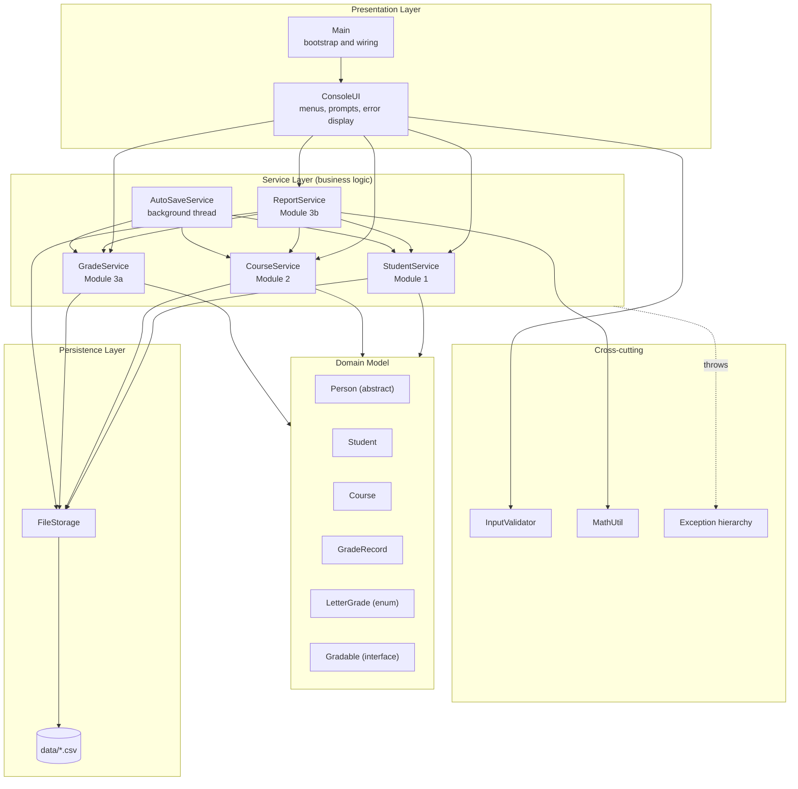
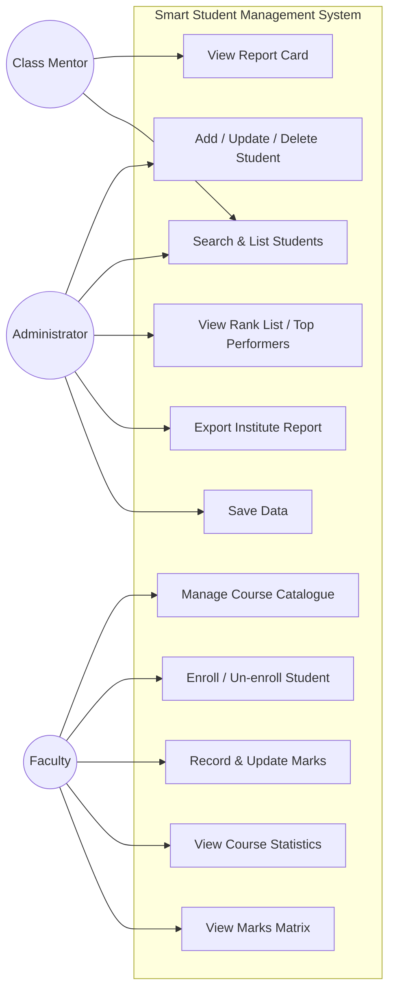
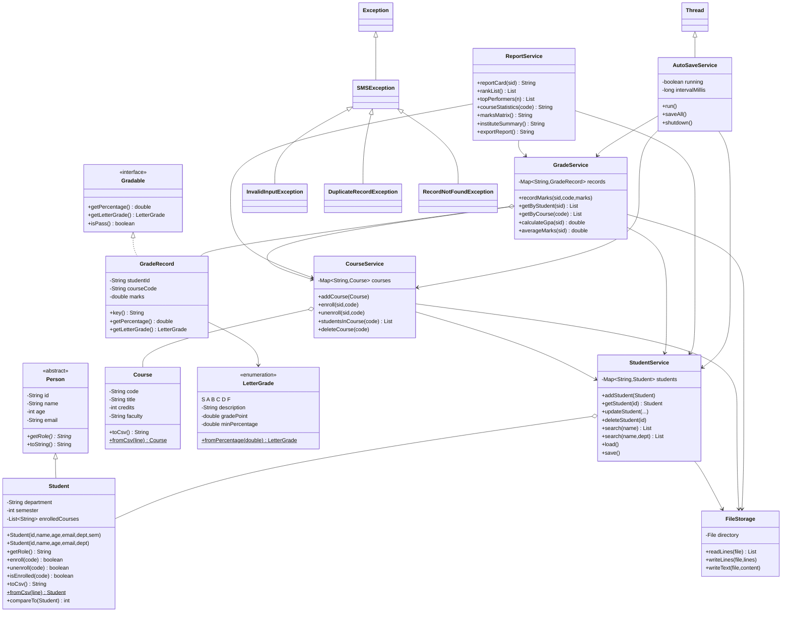
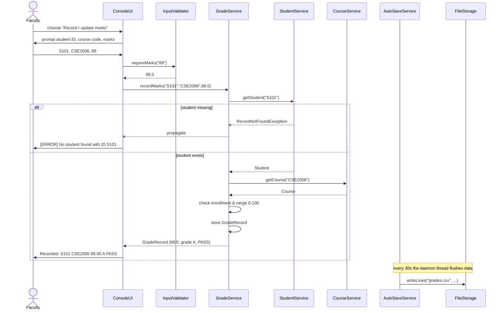
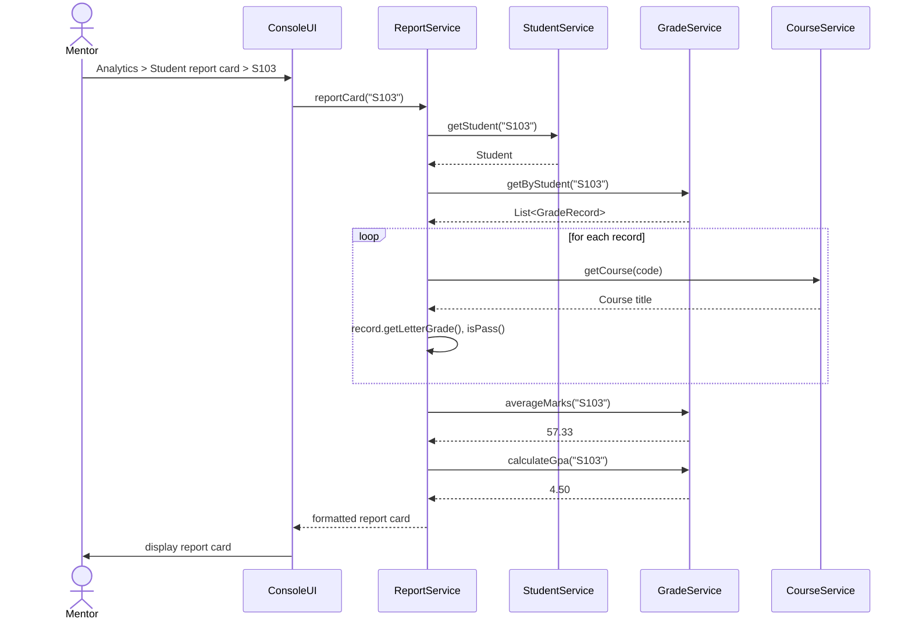
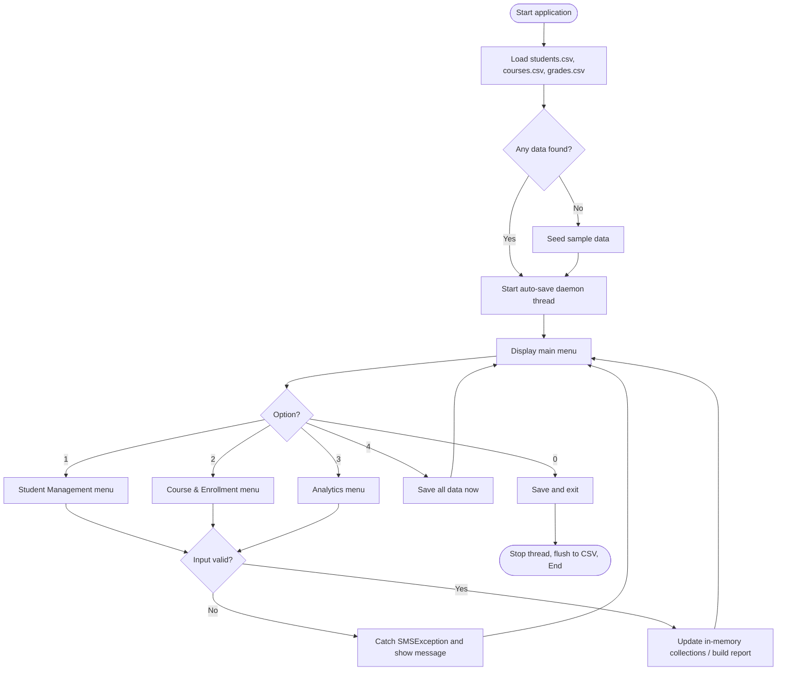
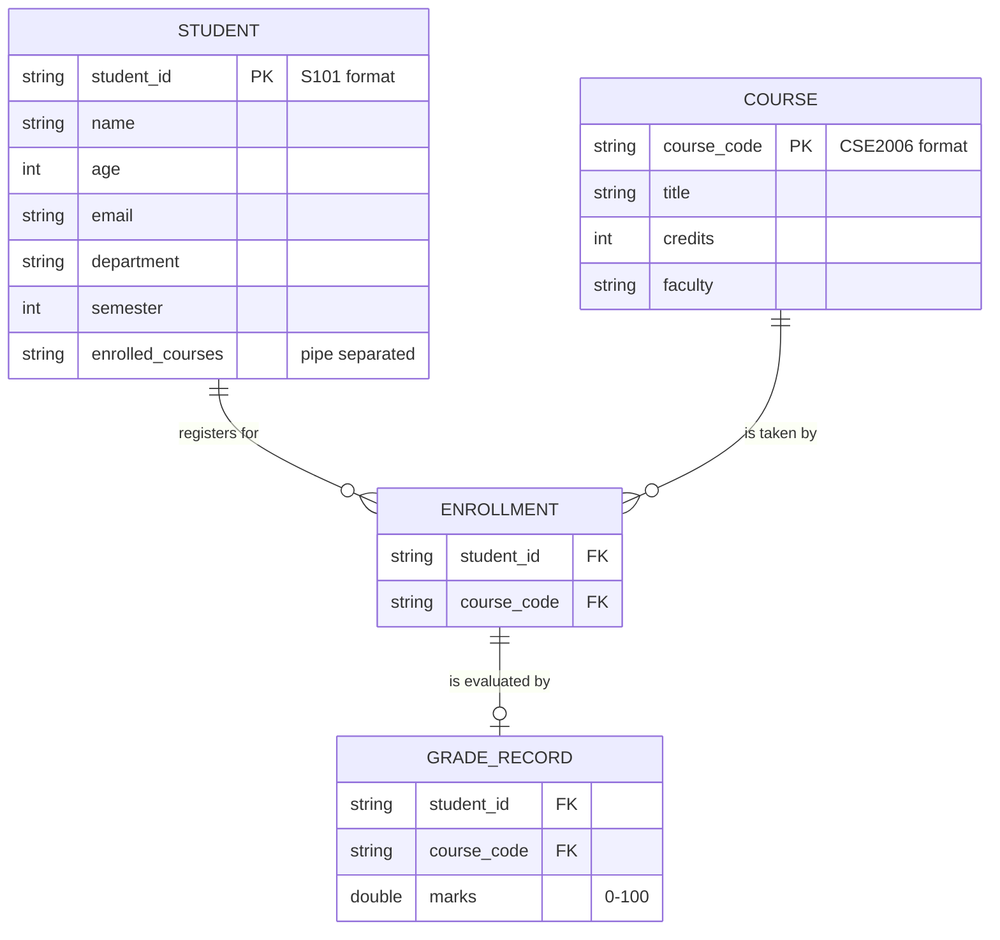

# Design Diagrams

All diagrams are written in Mermaid, which GitHub renders automatically.
For the PDF report, open this file on GitHub and take screenshots, or paste the
code into <https://mermaid.live> to export PNG/SVG.

---

## 1. System Architecture

---

## 2. Use Case Diagram

---

## 3. Class Diagram

---

## 4. Sequence Diagram — Recording Marks

---

## 5. Sequence Diagram — Generating a Report Card

---

## 6. Process / Workflow Diagram

---

## 7. ER / Storage Design

### Physical file schema

| File | Format | Example row |
|---|---|---|
| `data/students.csv` | `id,name,age,email,department,semester,course1\|course2\|...` | `S101,Aarav Sharma,19,aarav@vit.ac.in,CSE,3,CSE2006\|CSE2001` |
| `data/courses.csv` | `code,title,credits,faculty` | `CSE2006,Programming in Java,3,Dr. Ashwin` |
| `data/grades.csv` | `studentId,courseCode,marks` | `S101,CSE2006,88.0` |
| `data/report_*.txt` | Plain text export | generated on demand |

**Note:** the enrollment relation is denormalised into the `enrolled_courses`
column of `students.csv`, since flat-file storage has no join capability. The
`GRADE_RECORD` composite key `(student_id, course_code)` is represented in
memory as the map key `studentId::courseCode`.
